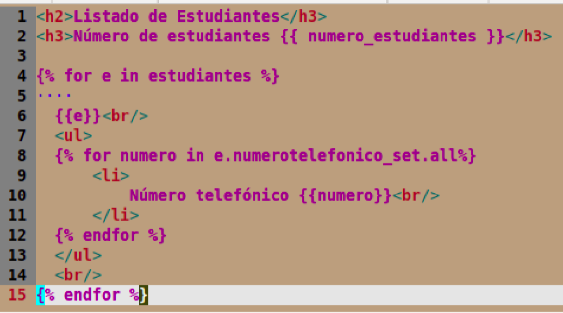

# clase03-2bim

# Imagen

* se usa el numerotelefonico_set.all por que no existe uan relacion de relate_name hacia un numero telefonico

### 25 junio 2025
Parte del flujo para NumeroTelefonicoEstudianteForm

* Cuando se seleciona un estudiante se llama la vista de crear_numero_telefonico_estudiante se obtiene el id de estudiante una ves con el id se va a la creacion del formulario de crea la intancia de NumeroTelefonicoEstudianteForm y se le pasa el estudagit inte como argumento, en la vista del usuario solo se le va a mostrar que ingrese el numero de telefono y el tipo y cuando le da a enviar guarda el numero de telefono al estudiante 

NumeroTelefonicoEstudianteForm
* Lo que hace el agregar telefonos a un estudiante en especifico

NumeroTelefonicoEstudianteForm

* Recibe al estudainte como un argumento tambien ayuda a ocultar el campo estudiante en el formulario